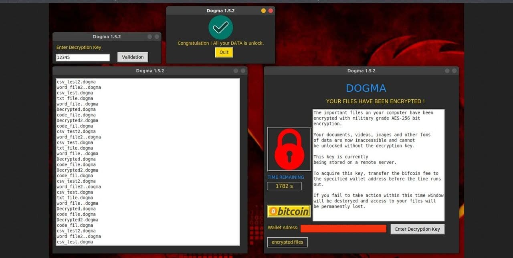

 

<h3> RansomeWare  Dogma V1.5.3</h3>

 Questo Ransomware non deve essere utilizzato per danneggiare/minacciare/ferire il computer di altre persone. Il suo scopo è solo quello di condividere la conoscenza e la consapevolezza su malware/crittografia/sistemi operativi/programmazione. Questo ransomware è stato creato per l'apprendimento e la consapevolezza sulla sicurezza/crittografia. 

-----------------------------------------------------------------------------------------------------------------------------

Environement:
-------------
- Ubuntu 18.4 | Tested | No compile
- Windows 10 | Tested | Compiled
- Pycharm
- Python 3.6

Module:
-----
- Pillow
- import tkinter as tk
- import tkinter
- import os
- import sys
- import webbrowser
- import pyAesCrypt

Compilation:
-----------
- >pip install auto-py-to-exe
- >auto-py-to-exe 
- insert manually all visual data 

Informations:
-------------

- se si ottiene tutto il modulo e si cambia il "percorso" in dogma.py in ./Encrypted_Data lo script è pronto all'uso.

- Creo più file in Encryped_Data da criptare (.txt, .csv, .docx, .py).
Questa cartella ha anche 2 cartelle figlio con esattamente lo stesso file per mostrare la crittografia ricorsiva di DOGMA.

- Copia e incolla da test_file a Encrypted Data se vuoi criptare nuovamente tutti i file.

- Attenzione: per default Dogma.py è configurato per criptare C:-Users 
                                                                                                   
